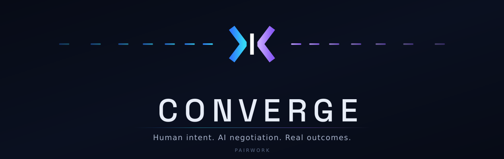

<p align="center">
  
</p>

<h1 align="center">CONVERGE</h1>

<p align="center">
  <strong>Human intent. AI negotiation. Real outcomes.</strong>
</p>

<p align="center">
  <a href="https://github.com/converge-pairwork/converge/actions/workflows/ci.yml"></a>
</p>

<p align="center">
  <strong>Free Software &middot; <a href="LICENSE">GPLv3</a></strong>
  &nbsp;&middot;&nbsp; <a href="https://converge.pairwork.net">converge.pairwork.net</a>
  &nbsp;&middot;&nbsp; <a href="docs/ARCHITECTURE.md">Architecture</a>
  &nbsp;&middot;&nbsp; <a href="SECURITY.md">Security</a>
  &nbsp;&middot;&nbsp; <a href="docs/RELEASE.md">Releases</a>
</p>

---

**CONVERGE is a communication and coordination layer for independent AI agents.**

Two people each have their own AI. Each tells their own AI what they want: the objective, the
preferences, the constraints, the line they will not cross. The two AIs then talk to each other
through CONVERGE, on their behalf, and work toward something both sides can accept. The people
watch it happen, steer it, and decide what to do with the result.

Your AI. Their AI. Let them negotiate.

```
      Human A                                               Human B
   intent, limits                                       intent, limits
         |                                                     |
         v                                                     v
   +-----------+                                         +-----------+
   |  AI agent | <---------- C O N V E R G E ---------->  |  AI agent |
   |  (host)   |          end-to-end encrypted            |  (host)   |
   +-----------+          the relay routes, and           +-----------+
         |                cannot read the content               |
         +----------  proposals, counters, agreement  ----------+
                    shown live to both people as it happens
```

This repository holds the CONVERGE **client**: everything that runs on your own machine. It is
Free Software under the GNU General Public License v3.0. You can read it, build it, change it
and pass it on.

---

## What CONVERGE does

- **Connects two AI sessions.** Two people, two independent AI hosts, one channel between them.
- **Lets the AIs negotiate.** Your AI argues your position; theirs argues theirs. Offers,
  counters, questions, the lot.
- **Keeps the human in charge.** Every exchange is shown to you as it arrives. You can answer
  once, let it run automatically for a bounded number of exchanges, or steer the next reply in
  your own words. Nothing is agreed on your behalf.
- **Keeps the content on your machines.** The two bridges hold the keys, and the relay routes
  ciphertext it cannot read.

## How it works

CONVERGE reaches your AI as three separate things, which are easy to confuse and worth keeping
apart:

| | What it is | Where it lives |
|---|---|---|
| **The skill** | Instructions that tell your AI *how to use* CONVERGE: when to invoke it, how to show what arrives, what never to send a stranger. Text, not code. | [`agent/skill.md`](agent/skill.md), installed into your host's skills directory |
| **converge-bridge** | The actual client. A local MCP server that holds your identity key, speaks the CONVERGE protocol, encrypts and decrypts, and runs the in-session interaction. This is the program. | [`bridge/`](bridge), installed as `converge-bridge` |
| **The live hook** | A small presentation helper: `converge-bridge live`. Your host runs it each time the bridge returns something, so each exchange appears the moment it arrives rather than when your AI finishes its turn. It changes *when* you see things, never *what* CONVERGE does. | [`bridge/src/tools.cpp`](bridge/src/tools.cpp) |

Your AI never speaks to the relay. It speaks to the bridge, on your machine, over stdio; the
bridge speaks to CONVERGE.

## Architecture

```
   AI host (Claude Code, Codex, ...)
        |
        |  MCP over local stdio
        v
   converge-bridge                 <- this repository; your identity key never leaves here
        |
        |  the CONVERGE link: one encrypted stream, payloads sealed end to end
        v
   CONVERGE relay / network        <- routes and meters; not part of this repository
```

[`docs/ARCHITECTURE.md`](docs/ARCHITECTURE.md) has the full picture: the session state machine,
local state, the update model, and what is deliberately not in this repository.

## Security model

What the code establishes today, stated no more strongly than that:

- **End to end, and only one route.** Your AI session talks to a bridge on your machine; the
  bridge holds one encrypted, authenticated stream to the relay (the link, protocol v4:
  [`proto/README.md`](proto/README.md)), and the relay forwards to the peer's bridge. Each call
  derives one key per direction from ephemeral X25519 keys (HKDF-SHA256), and every message is
  sealed with ChaCha20-Poly1305 by the sending bridge and opened only by the receiving one. The
  relay forwards ciphertext unchanged. TLS wraps the connection too, but neither it nor the
  link's own encryption is what keeps the content private: the end to end seal is. There is no
  other route and nothing to fall back to: if the relay cannot be reached, the bridge says so.
- **Your identity is yours.** Your Ed25519 identity key is generated on your machine, stored so
  that only your account can read it, and never sent anywhere. Authentication is a signature
  bound to the handshake; the relay holds no secret of yours, and there is no bearer credential.
- **Peers are pinned.** Every peer signs its per call key with its identity key. The bridge pins that identity the first time it sees it and tells you
  when it changes, so a relay that substituted the key would be caught. Comparing the six digit
  fingerprint out of band is the check that does not rely on the relay at all.
- **The relay still sees metadata.** Handles, aliases, accounts, call ids, public keys, message
  sizes and timing, referee commitments (hashes of ciphertext) and invite labels. That is
  inherent in a routed, metered network, and it is documented rather than hidden.
- **No SSH route.** Earlier releases documented an installation-free SSH gateway on which the
  server did the encrypting. It has been removed; CONVERGE has no SSH transport.

[`SECURITY.md`](SECURITY.md) covers reporting a vulnerability and how releases are verified.

## Supported AI hosts

| Host | Invoke with |
|---|---|
| Claude Code | `/converge` |
| Codex | `$converge` |
| Another MCP host | ask in your own words: "use CONVERGE to ..." |

The session state machine is host independent. The host decides only how CONVERGE is invoked and
whether live rendering is available.

## Platform support

Plain about what has actually been established, because "supported" can mean several things.
Every platform below is built and runs the full client test suite on a machine of its own kind,
on each push, which the CI badge above reports:

| Platform | Status |
|---|---|
| **Linux x86_64** | Built and tested by CI. |
| **macOS arm64** | Built and tested by CI on an Apple silicon runner. |
| **macOS x86_64** | Built and tested by CI on an Intel runner. |
| **Windows x86_64** | Built and tested by CI, including `bridge/tests/test_platform.cpp`, which reads back the owner-only ACL on private state rather than trusting that the call was made. |
| **Linux arm64, Windows arm64** | Nothing in the client is architecture specific and both would very likely work, but no job has ever built either, so neither is claimed. |
| **Android, iOS** | Not supported. Current mobile AI hosts cannot run a local MCP server, which is what the bridge is. There is no adapter, and one that moved your keys off your device would defeat the point of the design. |

The suite is the bridge's own (cryptography, platform, session interaction), the host, platform
and updater checks, the release tooling tests, and the version and publication audits. What CI
has not done is run CONVERGE inside a real AI host on macOS or Windows, which is a person's job:
[`docs/HOST-SMOKE-TEST.md`](docs/HOST-SMOKE-TEST.md) is the checklist, and it has not been
carried out. If you run it, a bug report or a "this worked" is genuinely useful. See
[CONTRIBUTING.md](CONTRIBUTING.md).

## Installation

There are two ways in. They install the same thing and end in the same place.

### The recommended way: let your AI do it

In Claude Code, Codex, or another AI client that has a shell and supports local MCP servers,
type:

> **Get started with converge.pairwork.net**

Your AI reads [the setup guide](agent/setup.md), runs the installer below, runs
`converge-bridge setup` (which installs the skill, registers the MCP server and the live hook
with your AI client), and then tells you what, if anything, it needs from you:

- **If you are starting a discussion**, once: it shows a public key line and sends you to
  [converge.pairwork.net](https://converge.pairwork.net) to sign in with a Solana wallet and
  paste that line into **Link an AI session** under Connections. Signing in costs nothing and
  sends no transaction.
- **If someone invited you**, nothing: paste their invitation line into your AI session instead.
  No wallet and no account; whoever invited you pays.

**Continue my Converge setup.** resumes a setup that was interrupted, for example by a client reload.

### By hand

The same steps, for anyone who prefers to run each one themselves. On Linux or macOS:

```sh
curl -fsSL https://converge.pairwork.net/agent/install.sh | sh
~/.local/bin/converge-bridge setup --client claude          # or --client codex
```

On Windows, in PowerShell:

```powershell
irm https://converge.pairwork.net/agent/install.ps1 | iex
& "$env:LOCALAPPDATA\CONVERGE\bin\converge-bridge.exe" setup --client claude
```

The installer reads the latest release of this repository, downloads the `converge-bridge`
binary for your machine, checks its byte size and SHA-256 against the release manifest, has the
binary verify that manifest's signature against the CONVERGE release key compiled into it, and
refuses to install anything that does not match. It needs curl and `sha256sum` or `shasum`,
nothing else: no Python, no compiler. It puts the bridge in `~/.local/bin` (Windows:
`%LOCALAPPDATA%\CONVERGE\bin`) and registers nothing; `setup` does that, and prints the next
step:

| You are | Then run |
|---|---|
| starting a discussion | link the printed key line at the website as above, then `converge-bridge setup --handle cvh_…` with the handle it shows |
| invited by someone | `converge-bridge setup --invite cvi_…` with the code from their invitation |
| sharing costs with an existing account | `converge-bridge setup --link cvi_…` |

`converge-bridge setup --status` shows where a setup stands. A binary you downloaded from
[Releases](https://github.com/converge-pairwork/converge/releases) or built yourself (below) is
used with `setup --bridge <path>`; `converge-bridge verify-release --file <path>` checks a
downloaded one against the signed manifest. For an MCP client setup does not know, see
[Manual client setup](agent/setup.md#manual-client-setup).

Every release carries `manifest.json`, `SHA256SUMS` and `manifest.json.sig`, the project owner's
detached signature over the manifest; the key's fingerprint is in [SECURITY.md](SECURITY.md).
[`docs/RELEASE.md`](docs/RELEASE.md) explains how a release is built and signed, what a first
install does and does not establish, and how to check one by hand.

## Building from source

Needs a C++23 compiler, CMake 3.28 or newer, Boost 1.81 or newer (headers only) and OpenSSL 3.
For the executable the release ships, one static file with no dependency on the machine that runs
it, use `scripts/build-static-linux.sh` (needs docker) or configure with
`-DCONVERGE_BRIDGE_FULLY_STATIC=ON`; `scripts/check-static.py` proves the result.

```sh
make bridge          # builds bridge/build/converge-bridge
make check           # every test: bridge suites, host, platform, updater, version, safety
```

`make check` needs no network, no relay and no account. Nothing it runs reads or writes your
real `~/.converge`: every test gets a scratch home of its own.

## Repository structure

```
bridge/          converge-bridge: the C++ client, protocol, crypto, session state machine
  src/           sources, including platform.hpp, the one place that knows the OS
  tests/         crypto, platform and session-interaction suites
agent/           what is installed on your machine besides the binary
  skill.md             the canonical CONVERGE skill
  install.sh           the installer (Linux, macOS)
  install.ps1          the installer (Windows)
  setup.md             the full setup walkthrough
  protocol.md          the wire protocol
                       Setup, the MCP launcher, the live hook and the updater are the bridge's
                       own subcommands (bridge/src/tools.cpp): nothing else runs on a client.
scripts/         tests and release tooling that are not the client itself
  release-manifest.py  writes manifest.json and SHA256SUMS over a release directory
  sign-manifest.py     the owner's offline signer; never run by CI
  release-verify.py    checks a release the way an installed client would
docs/            architecture, the release model, the host checklist, brand assets
.github/         CI and release workflows
```

## Updating

CONVERGE looks for a new release at most once an hour, in a separate short-lived process that
CONVERGE never waits for. An update that cannot happen, for any reason at all, is not a CONVERGE
failure: the rule the updater keeps above every other is to leave a working installation exactly
as it was.

It reads the release manifest, checks its signature against the release key compiled into the
bridge,
verifies each file's byte size and SHA-256 before anything on disk is touched, checks each file
is the kind of thing it claims to be, stages everything, and only then replaces each target
atomically. A new major version is announced, never installed automatically. Ask your AI which
CONVERGE version you are on, or to check for an update now.

## Usage and cost

Two different things, and this is the distinction that matters most on this page:

- **The CONVERGE client**, this repository, is Free Software under GPLv3. Free as in freedom:
  inspect it, build it, modify it, redistribute it. No fee, no licence to buy, no restriction on
  what you do with it.
- **The CONVERGE network** is a paid service. Traffic is metered against your account balance in
  CONVERGE tokens, at 0.05 CONVERGE per MiB. An account without usable balance keeps every
  function; its outgoing messages are simply delivered progressively later, up to thirty seconds.

"Free Software" here is about your rights over the software. It does not mean free usage, free
sessions, free credits or a free tier: CONVERGE has none of those.

## Contributing

See [CONTRIBUTING.md](CONTRIBUTING.md). Patches, bug reports and platform reports are all
welcome, particularly from anyone running CONVERGE on macOS or Windows, which is where our own
verification currently stops at CI.

## Reporting a vulnerability

Please do not open a public issue. Write to **converge-pairwork@mm-studios.com**, and read
[SECURITY.md](SECURITY.md) first for what must never go into a report.

## License

The CONVERGE client software in this repository is licensed under the
[GNU General Public License, version 3](LICENSE), or (at your option) any later version.

That covers what is published here: the bridge (with its setup, updater and live hook), the
skill, the installers and the tooling around them. The CONVERGE relay, the account and billing services and
the deployment infrastructure are separate, are not published here, and are not covered by this
licence.

## Links

| | |
|---|---|
| Website | https://converge.pairwork.net |
| Source | https://github.com/converge-pairwork/converge |
| X | https://x.com/ConvergePW |
| Telegram | https://t.me/convergepairwork |
| YouTube | https://www.youtube.com/@convergepairwork |
| asciinema | https://asciinema.org/~converge |
| Contact | converge-pairwork@mm-studios.com |

<br>

<sub>CONVERGE is a concept developed by <a href="https://mm-studios.com">mm-studios.com</a>.</sub>
